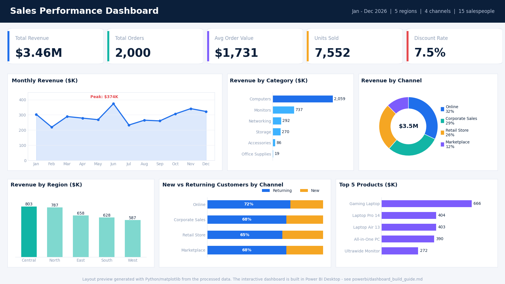
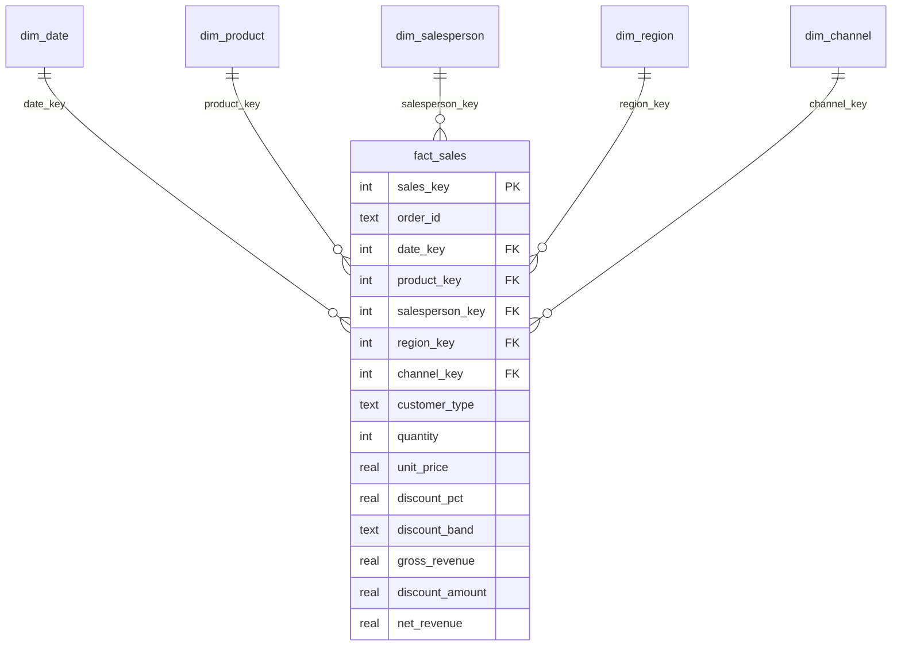

# Sales Performance Analytics | SQL + Power BI

An end-to-end analytics project: raw Excel sales data -> cleaned and validated with **Python + SQL** -> modelled as a **star schema** -> visualised in a **Power BI dashboard** with DAX measures.


> Layout preview generated from the project data. Replace it with a screenshot of the finished `.pbix` (see `powerbi/dashboard_build_guide.md`).

## Business questions answered
1. How much revenue, how many orders, and what average order value did we achieve? How much did discounting cost?
2. How does revenue trend month to month, and which months over- or under-perform?
3. Which product categories and products drive the business (Pareto)?
4. Which regions, channels and salespeople perform best?
5. How much revenue comes from returning vs new customers?
6. Does deeper discounting actually lead to bigger orders?

## Key findings
| # | Finding |
|---|---|
| 1 | **$3.46M** net revenue from **2,000 orders** (7,552 units); average order value **$1,731**. Discounts cost **$281K (7.5%)** of gross revenue. |
| 2 | **Computers generate 59.5%** of revenue and Monitors 21.3%, so two of six categories deliver over 80%. Accessories has the most orders (503) but only 2.5% of revenue. |
| 3 | The **top 4 products are all computers** (53.8% of revenue); the top 10 products reach 86.4%. Gaming Laptop alone is 19.2%. |
| 4 | **Large orders (> 3x average) are 10.5% of orders but 45.4% of revenue**, so revenue depends on a small set of big-ticket deals. |
| 5 | **Central** leads regions ($803K, highest average order value at $1,862); **West** is lowest ($587K). North has the most orders (478) but the highest discount rate (8.3%). |
| 6 | **Online** is the largest channel ($1.11M). Returning customers account for **65-72%** of revenue in every channel. |
| 7 | Deeper discounts did not go with larger orders: the 1-5% band has the highest average order value ($2,013), while the >10% band averages $1,601 with similar units per order (3.8 vs 3.7). This is an association, not proof; product mix also differs by band. |
| 8 | Top salesperson: **Mei Tan** ($320K). Monthly peaks and troughs (June peak $374K, February low $219K) depend on the date question below. |

Full query output: [`docs/analysis_results.md`](docs/analysis_results.md).

## Architecture


### Data model (star schema)


## Repository structure
```
sales-analytics-powerbi-sql/
├── data/
│   ├── raw/sales_raw.xlsx           # original data (2,000 orders, 12 columns)
│   └── processed/                   # star-schema CSVs generated for Power BI
├── sql/
│   ├── 01_schema.sql                # staging table + dimensions + fact (DDL, keys, indexes)
│   ├── 02_data_quality_checks.sql   # 9 validation checks
│   ├── 03_build_star_schema.sql     # dim_date (recursive CTE), dimensions, fact load
│   ├── 04_views.sql                 # vw_sales_flat, vw_monthly_summary
│   └── 05_business_analysis.sql     # 12 business queries (CTEs, window functions, pivots)
├── python/
│   ├── build_database.py            # runs the whole pipeline
│   └── make_dashboard_preview.py    # renders docs/dashboard_preview.png
├── powerbi/
│   ├── dax_measures.dax             # 25 DAX measures
│   ├── theme.json                   # custom colour theme
│   └── dashboard_build_guide.md     # step-by-step build + visual layout
├── docs/                            # preview, data-quality report, analysis results
├── requirements.txt
└── README.md
```

## How to run
```bash
pip install -r requirements.txt
python python/build_database.py        # builds sales.db, runs checks, exports CSVs, writes docs
python python/make_dashboard_preview.py  # optional preview image
```
Then follow [`powerbi/dashboard_build_guide.md`](powerbi/dashboard_build_guide.md) in Power BI Desktop.

## Data cleaning and quality
- **Mixed date formats:** 1,215 dates were text (`M/D/YYYY`) and 785 were real Excel dates. All were standardised to ISO `YYYY-MM-DD`. The text dates are unambiguous (every one has a day above 12). See **Open data question** below for the real Excel dates.
- **Validation:** no duplicate order IDs, no blanks, no non-positive quantities or prices, every product maps to one category, every salesperson to one region.
- **Revenue reconciliation:** revenue matches `quantity x unit price x (1 - discount)` within rounding. Unit prices are stored to 2 decimals, so 239 orders differ by a few cents. The check tolerance scales with quantity for this reason ([report](docs/data_quality_report.md)). This is also why the "No discount" band shows a $0.02 discount total.

## Open data question: day/month order of the Excel dates
Every real Excel date in the raw file has a day of 12 or less, and every text date has a day above 12. That clean split usually means a locale-based import turned the *ambiguous* dates into real dates (possibly with day and month swapped) and left the unambiguous ones as text. The data cannot prove it either way. The month profile of the 785 Excel dates matches the unambiguous rows better if day and month are swapped (correlation 0.54) than as stored (0.05), which is suggestive but not conclusive with 12 data points.

- **Default:** the stored Excel dates are trusted as-is (`SWAP_DAY_MONTH_FOR_EXCEL_DATES = False` in `python/build_database.py`).
- **If the data owner confirms a swap:** set it to `True`, rerun `python python/build_database.py`, and reload the CSVs.
- **What it affects:** month, quarter and weekday views and the trend. Totals, category, product, region, channel, salesperson and discount analysis are unchanged.

## Assumptions and notes
- `Revenue` is treated as **net revenue after discount**; gross revenue is derived as `quantity x unit price`.
- Price tiers (Premium >= $1,000, Mid-range >= $100, Budget below) and discount bands (0%, 1-5%, 6-10%, >10%) are analyst-defined thresholds.
- The data covers **January to December 2026** (including months after today's date, so it looks like sample data) and there is one year only, so year-over-year comparisons are not possible.
- Currency is not stated in the source file; `$` is used for display.

## Running the SQL on another database
The scripts are written in standard SQL and tested on SQLite. Changes needed elsewhere:

| Item | SQLite (used here) | SQL Server | PostgreSQL / MySQL |
|---|---|---|---|
| Date parts | `STRFTIME('%Y', d)` | `YEAR(d)`, `DATENAME(...)` | `EXTRACT(YEAR FROM d)` |
| Add a day | `DATE(d, '+1 day')` | `DATEADD(day, 1, d)` | `d + INTERVAL '1 day'` |
| Recursive CTE | `WITH RECURSIVE` | `WITH` + `OPTION (MAXRECURSION 0)` | `WITH RECURSIVE` |
| Text concat | `'Q' \|\| n` | `'Q' + CAST(n AS VARCHAR)` | `CONCAT('Q', n)` |
| Types | `TEXT`, `REAL` | `VARCHAR`, `DECIMAL(12,2)` | `VARCHAR`, `NUMERIC(12,2)` |

## Skills demonstrated
Data cleaning and validation, dimensional modelling (star schema), SQL (joins, CTEs, recursive CTEs, window functions, CASE pivots, views), Python (pandas, sqlite3), Power BI data modelling, DAX (time intelligence, ranking, Pareto, dynamic titles), dashboard design, and business storytelling.

## Possible extensions
Add targets/budget data for variance analysis, a customer table for cohort and retention analysis, cost data for profit margin, and scheduled refresh through a Power BI gateway.
